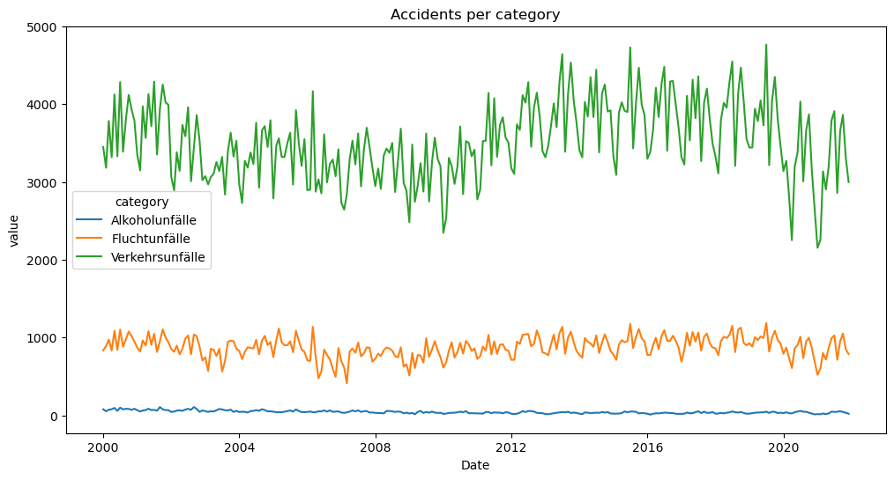
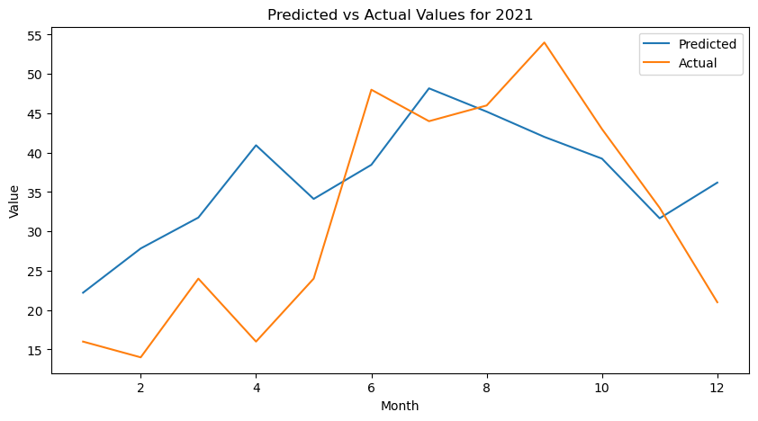
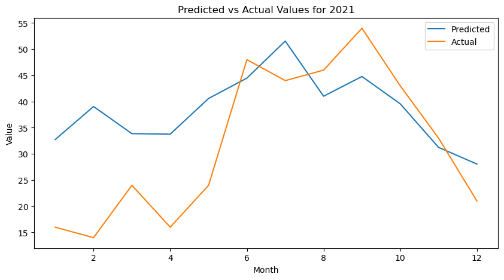
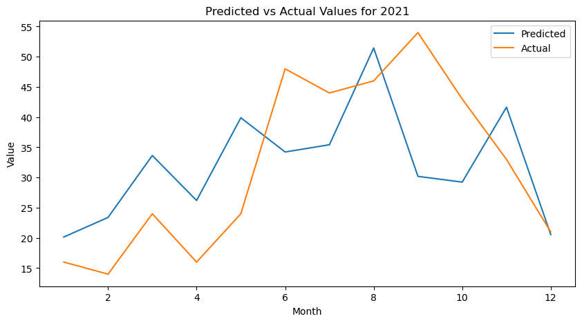
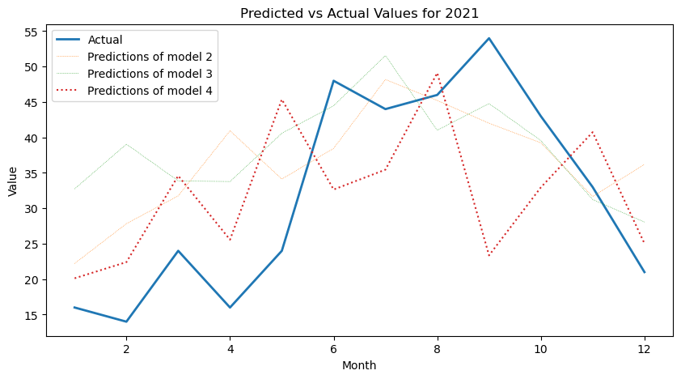

# taskOfAIDps

## About The Project
I used LSTM algorithm because we had previous data and we are asked to make predictions on next year.
I trained the four models each time I either implemented a different algorithm 
or different approach to model training. 
All of these models and their steps to training are explained in the files named:
* trainingModel[number].ipynb number is [1,2,3,4]

1- The first task was to ' visualise historically the number of accidents per category (column1). '
Here is my graph taken from the [drawingGraph.ipynb](drawingGraph.ipynb) file 

2- Here is my second model's result comparing to the real values of 2021

3- Here is my third model's result comparing to the real values of 2021

4- Here is my fourth model's result comparing to the real values of 2021

5- Here is the comparison of all my models to the real values of 2021

#I chose my last model to use
#I used Flask, Heroku and because my github repository was large for me to deploy it directly to Heroku, I used Docker.

* My website is https://dps-ai-task-goksu-7343c3186a4c.herokuapp.com/
* If you send request in this format to this website 
* data = {
    "year": 2021,
    "month": 1
}
* It will return this kind of information below:
* Prediction: 20.145708084106445 

<b> Thank you! Hope you liked my project </b>

